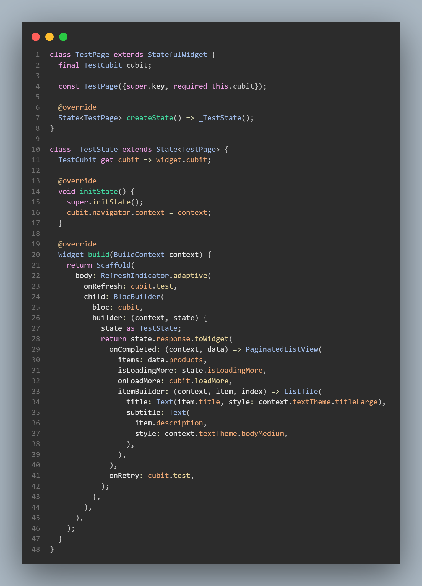
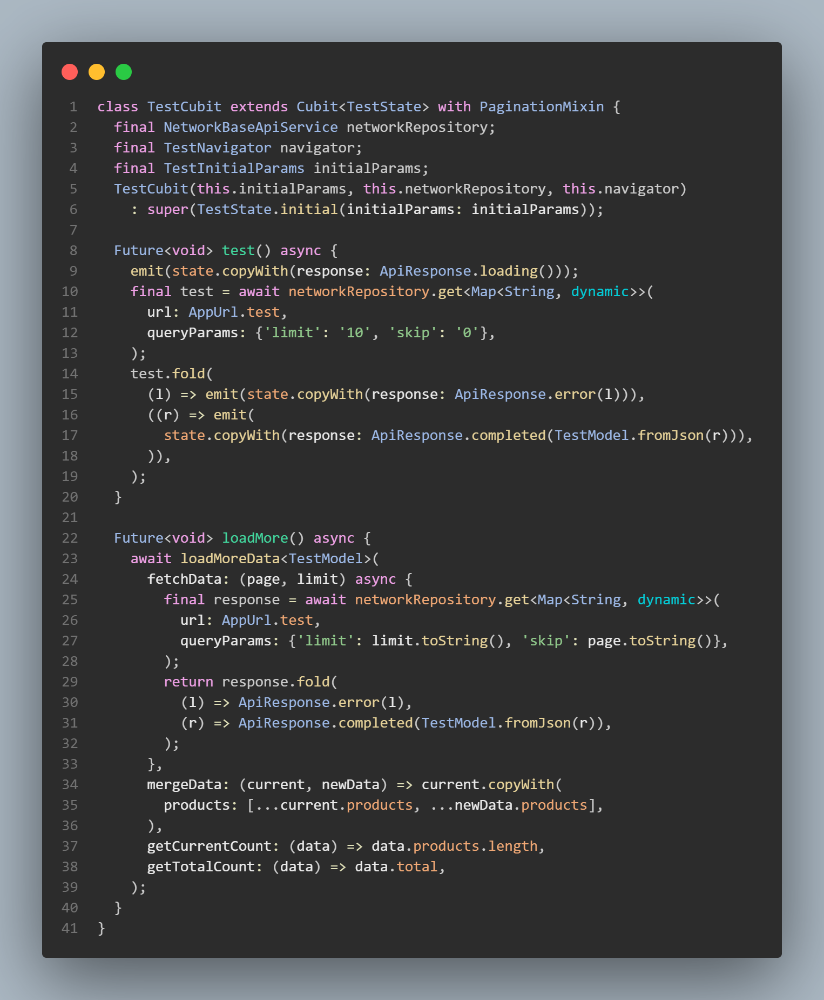
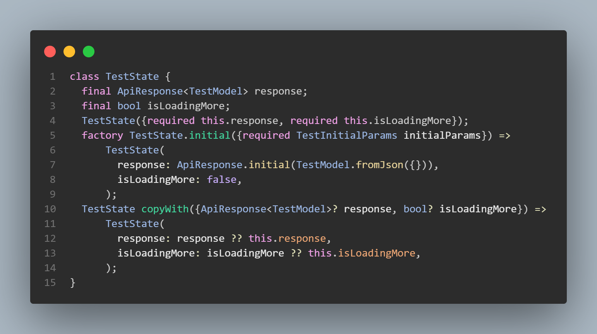

# 📦 Flutter Pagination Helper

<div align="center">
  
  
  [](https://pub.dev/packages/pagination_helper)
  [](https://opensource.org/licenses/MIT)
  [](https://flutter.dev)
</div>

A lightweight, **state-management-agnostic** Flutter package for implementing pagination with minimal boilerplate. Works with **ANY** state management solution!

## 📸 Screenshots

<div align="center">
  
### Example 1: Basic Usage

<br/><br/>

### Example 2: Advanced Configuration  

<br/><br/>

### Example 3: State Management Integration


</div>

## ✨ Features

- 🔄 **Universal Compatibility** - Works with Cubit, Bloc, Provider, Riverpod, GetX, setState, and more
- 📜 **PaginatedListView** - Automatic infinite scrolling with pull-to-refresh
- 📊 **PaginatedGridView** - Grid layout with pagination support
- 🧩 **PaginationMixin** - Zero framework dependencies
- 🔀 **Flexible** - Offset, page, and cursor-based pagination
- 🎨 **Customizable** - Loading indicators, empty states, thresholds, separators
- 🛡️ **Type-Safe** - Fully generic implementation

## 📥 Installation

```yaml
dependencies:
  pagination_helper: ^latest_version
```

```bash
flutter pub get
```

```dart
import 'package:pagination_helper/pagination_helper.dart';
```

## 🚀 Quick Start

### 1. Add the Widget

```dart
PaginatedListView<Product>(
  items: products,
  isLoadingMore: isLoadingMore,
  onLoadMore: () => cubit.loadMore(),
  onRefresh: () => cubit.refresh(),  // Optional
  itemBuilder: (context, product, index) {
    return ProductCard(product: product);
  },
)
```

### 2. Use PaginationMixin

```dart
class ProductCubit extends Cubit<ProductState> with PaginationMixin {
  Future<void> loadMore() async {
    await loadMoreData<ProductData>(
      fetchData: (offset, limit) async {
        return await apiService.getProducts(skip: offset, limit: limit);
      },
      mergeData: (current, newData) => current.copyWith(
        products: [...current.products, ...newData.products],
        total: newData.total,
      ),
      getCurrentCount: (data) => data.products.length,
      getTotalCount: (data) => data.total,
      updateState: (isLoading, data, error) {
        emit(state.copyWith(
          data: data ?? state.data,
          isLoadingMore: isLoading,
          error: error,
        ));
      },
      currentData: state.data,
      isCurrentlyLoading: state.isLoadingMore,
    );
  }
}
```

**That's it!** Your pagination is working. 🎉

## 📖 Usage Examples

### Grid View

```dart
PaginatedGridView<Product>(
  items: products,
  isLoadingMore: isLoadingMore,
  onLoadMore: () => controller.loadMore(),
  crossAxisCount: 2,
  itemBuilder: (context, product, index) => ProductGridCard(product),
)
```

### Custom Loading Widget

```dart
PaginatedListView<Product>(
  items: products,
  isLoadingMore: isLoadingMore,
  onLoadMore: () => cubit.loadMore(),
  loadingWidget: const Center(
    child: CircularProgressIndicator(),
  ),
  itemBuilder: (context, product, index) => ProductCard(product),
)
```

### Custom Empty State

```dart
PaginatedListView<Product>(
  items: products,
  isLoadingMore: isLoadingMore,
  onLoadMore: () => cubit.loadMore(),
  emptyWidget: const Center(
    child: Text('No products found'),
  ),
  itemBuilder: (context, product, index) => ProductCard(product),
)
```

## 🎯 State Management Examples

### Flutter Bloc/Cubit

```dart
class ProductCubit extends Cubit<ProductState> with PaginationMixin {
  Future<void> loadMore() async {
    await loadMoreData<ProductData>(
      fetchData: (offset, limit) async {
        return await apiService.getProducts(skip: offset, limit: limit);
      },
      mergeData: (current, newData) => current.copyWith(
        products: [...current.products, ...newData.products],
        total: newData.total,
      ),
      getCurrentCount: (data) => data.products.length,
      getTotalCount: (data) => data.total,
      updateState: (isLoading, data, error) {
        emit(state.copyWith(
          data: data ?? state.data,
          isLoadingMore: isLoading,
          error: error,
        ));
      },
      currentData: state.data,
      isCurrentlyLoading: state.isLoadingMore,
    );
  }
}
```

### Provider/ChangeNotifier

```dart
class ProductProvider with ChangeNotifier, PaginationMixin {
  ProductData _data = ProductData.empty();
  bool _isLoadingMore = false;

  Future<void> loadMore() async {
    await loadMoreData<ProductData>(
      fetchData: (offset, limit) async {
        return await apiService.getProducts(skip: offset, limit: limit);
      },
      mergeData: (current, newData) => current.copyWith(
        products: [...current.products, ...newData.products],
        total: newData.total,
      ),
      getCurrentCount: (data) => data.products.length,
      getTotalCount: (data) => data.total,
      updateState: (isLoading, data, error) {
        _isLoadingMore = isLoading;
        if (data != null) _data = data;
        notifyListeners();
      },
      currentData: _data,
      isCurrentlyLoading: _isLoadingMore,
    );
  }
}
```

### Riverpod

```dart
class ProductNotifier extends StateNotifier<ProductState> 
    with PaginationMixin {
  Future<void> loadMore() async {
    await loadMoreData<ProductData>(
      fetchData: (offset, limit) async {
        return await apiService.getProducts(skip: offset, limit: limit);
      },
      mergeData: (current, newData) => current.copyWith(
        products: [...current.products, ...newData.products],
        total: newData.total,
      ),
      getCurrentCount: (data) => data.products.length,
      getTotalCount: (data) => data.total,
      updateState: (isLoading, data, error) {
        state = state.copyWith(
          isLoadingMore: isLoading,
          data: data ?? state.data,
          error: error,
        );
      },
      currentData: state.data,
      isCurrentlyLoading: state.isLoadingMore,
    );
  }
}
```

### GetX

```dart
class ProductController extends GetxController with PaginationMixin {
  final products = <Product>[].obs;
  final isLoadingMore = false.obs;

  Future<void> loadMore() async {
    final currentData = ProductData(
      products: products.toList(),
      total: total.value,
    );

    await loadMoreData<ProductData>(
      fetchData: (offset, limit) async {
        return await apiService.getProducts(skip: offset, limit: limit);
      },
      mergeData: (current, newData) => ProductData(
        products: [...current.products, ...newData.products],
        total: newData.total,
      ),
      getCurrentCount: (data) => data.products.length,
      getTotalCount: (data) => data.total,
      updateState: (isLoading, data, err) {
        isLoadingMore.value = isLoading;
        if (data != null) {
          products.value = data.products;
          total.value = data.total;
        }
      },
      currentData: currentData,
      isCurrentlyLoading: isLoadingMore.value,
    );
  }
}
```

### setState (StatefulWidget)

```dart
class _ProductListPageState extends State<ProductListPage> 
    with PaginationMixin {
  List<Product> products = [];
  bool isLoadingMore = false;

  Future<void> loadMore() async {
    final currentData = ProductData(products: products, total: total);

    await loadMoreData<ProductData>(
      fetchData: (offset, limit) async {
        return await apiService.getProducts(skip: offset, limit: limit);
      },
      mergeData: (current, newData) => ProductData(
        products: [...current.products, ...newData.products],
        total: newData.total,
      ),
      getCurrentCount: (data) => data.products.length,
      getTotalCount: (data) => data.total,
      updateState: (isLoading, data, err) {
        setState(() {
          isLoadingMore = isLoading;
          if (data != null) {
            products = data.products;
            total = data.total;
          }
        });
      },
      currentData: currentData,
      isCurrentlyLoading: isLoadingMore,
    );
  }
}
```

## 🚀 Advanced Features

### Pagination Types

#### Offset-Based (Default)

```dart
await loadMoreData<ProductData>(
  fetchData: (offset, limit) async {
    // offset: 0, 10, 20, 30...
    return await api.getProducts(skip: offset, limit: limit);
  },
  // ... other parameters
);
```

#### Page-Based

```dart
await loadMoreWithPage<ProductData>(
  fetchData: (page, limit) async {
    // page: 1, 2, 3, 4...
    return await api.getProducts(page: page, limit: limit);
  },
  // ... other parameters
);
```

#### Cursor-Based

```dart
await loadMoreWithCursor<ProductData>(
  fetchData: (cursor, limit) async {
    // cursor: null, "cursor1", "cursor2"...
    return await api.getProducts(cursor: cursor, limit: limit);
  },
  getNextCursor: (data) => data.nextCursor,
  hasMoreData: (data) => data.nextCursor != null,
  // ... other parameters
);
```

### Error Handling

```dart
await loadMoreData<ProductData>(
  fetchData: (offset, limit) async {
    try {
      return await api.getProducts(skip: offset, limit: limit);
    } catch (e) {
      throw Exception('Failed to load: $e');
    }
  },
  updateState: (isLoading, data, error) {
    if (error != null) {
      // Handle error
      emit(state.copyWith(error: error));
    } else if (data != null) {
      // Handle success
      emit(state.copyWith(data: data));
    }
    emit(state.copyWith(isLoadingMore: isLoading));
  },
  // ... other parameters
);
```

### Customization Options

```dart
PaginatedListView<Product>(
  items: products,
  isLoadingMore: isLoadingMore,
  onLoadMore: () => cubit.loadMore(),
  loadMoreThreshold: 500.0,  // Trigger 500px before bottom
  separatorBuilder: (context, index) => const Divider(),
  enableRefresh: true,  // Enable/disable pull-to-refresh
  itemBuilder: (context, product, index) => ProductCard(product),
)
```

## 📚 Common Patterns

### Data Model

```dart
class ProductData {
  final List<Product> products;
  final int total;

  ProductData({required this.products, required this.total});

  ProductData copyWith({
    List<Product>? products,
    int? total,
  }) {
    return ProductData(
      products: products ?? this.products,
      total: total ?? this.total,
    );
  }

  static ProductData empty() => ProductData(products: [], total: 0);
}
```

### Loading Initial Data

```dart
@override
void initState() {
  super.initState();
  loadMore();  // Load first page
}

// Or in Cubit constructor
ProductCubit({required this.apiService}) 
  : super(ProductState.initial()) {
  loadMore();
}
```

## 📖 API Reference

### PaginatedListView\<T\>

| Parameter | Type | Required | Default | Description |
|-----------|------|----------|---------|-------------|
| `items` | `List<T>` | ✅ | - | List of items to display |
| `isLoadingMore` | `bool` | ✅ | - | Loading flag from state |
| `itemBuilder` | `Widget Function(BuildContext, T, int)` | ✅ | - | Builder for items |
| `onLoadMore` | `VoidCallback` | ✅ | - | Called when more items needed |
| `onRefresh` | `Future<void> Function()?` | ❌ | `null` | Pull-to-refresh callback |
| `loadingWidget` | `Widget?` | ❌ | Default | Custom loading indicator |
| `emptyWidget` | `Widget?` | ❌ | `null` | Widget shown when empty |
| `loadMoreThreshold` | `double` | ❌ | `200.0` | Distance from bottom (px) |
| `separatorBuilder` | `Widget Function(BuildContext, int)?` | ❌ | `null` | Item separators |
| `enableRefresh` | `bool` | ❌ | `true` | Enable pull-to-refresh |

### PaginatedGridView\<T\>

Inherits all parameters from `PaginatedListView` plus:

| Parameter | Type | Required | Default | Description |
|-----------|------|----------|---------|-------------|
| `crossAxisCount` | `int` | ✅ | - | Number of columns |
| `childAspectRatio` | `double` | ❌ | `1.0` | Width/height ratio |
| `crossAxisSpacing` | `double` | ❌ | `0.0` | Horizontal spacing |
| `mainAxisSpacing` | `double` | ❌ | `0.0` | Vertical spacing |

### PaginationMixin

#### `loadMoreData<TData>`

Offset-based pagination method.

| Parameter | Type | Required | Description |
|-----------|------|----------|-------------|
| `fetchData` | `Future<TData> Function(int offset, int limit)` | ✅ | Fetch function |
| `mergeData` | `TData Function(TData current, TData newData)` | ✅ | Merge current and new data |
| `getCurrentCount` | `int Function(TData)` | ✅ | Get current item count |
| `getTotalCount` | `int Function(TData)` | ✅ | Get total available count |
| `updateState` | `void Function(bool isLoading, TData? data, String? error)` | ✅ | Update state callback |
| `currentData` | `TData` | ✅ | Current data from state |
| `isCurrentlyLoading` | `bool` | ✅ | Current loading flag |
| `limit` | `int` | ❌ | Items per page (default: 10) |
| `onError` | `void Function(dynamic)?` | ❌ | Optional error callback |

#### `loadMoreWithPage<TData>`

Page-based pagination (page starts from 1). Same parameters as `loadMoreData`, but `fetchData` receives `(page, limit)`.

#### `loadMoreWithCursor<TData>`

Cursor-based pagination.

| Parameter | Type | Required | Description |
|-----------|------|----------|-------------|
| `fetchData` | `Future<TData> Function(String? cursor, int limit)` | ✅ | Fetch with cursor |
| `getNextCursor` | `String? Function(TData)` | ✅ | Extract next cursor |
| `hasMoreData` | `bool Function(TData)` | ✅ | Check if more available |
| `mergeData` | `TData Function(TData current, TData newData)` | ✅ | Merge data |
| `updateState` | `void Function(bool isLoading, TData? data, String? error)` | ✅ | Update state |
| `currentData` | `TData` | ✅ | Current data |
| `isCurrentlyLoading` | `bool` | ✅ | Loading flag |
| `limit` | `int` | ❌ | Items per page (default: 10) |

## ⚠️ Requirements

- Flutter: `>=3.0.0`
- Dart: `>=3.0.0 <4.0.0`

## 🤝 Contributing

Contributions are welcome! Please feel free to submit a Pull Request.

1. Fork the repository
2. Create your feature branch (`git checkout -b feature/amazing-feature`)
3. Commit your changes (`git commit -m 'Add some amazing feature'`)
4. Push to the branch (`git push origin feature/amazing-feature`)
5. Open a Pull Request

## 📄 License

This project is licensed under the MIT License - see the LICENSE file for details.

## 👤 Author

**Munawer**

- GitHub: [@munawerdev](https://github.com/munawerdev)
- Repository: [pagination_helper](https://github.com/munawerdev/pagination_helper)

## 📝 Changelog

See [CHANGELOG.md](CHANGELOG.md) for detailed release notes.

---

Made with ❤️ for the Flutter community
